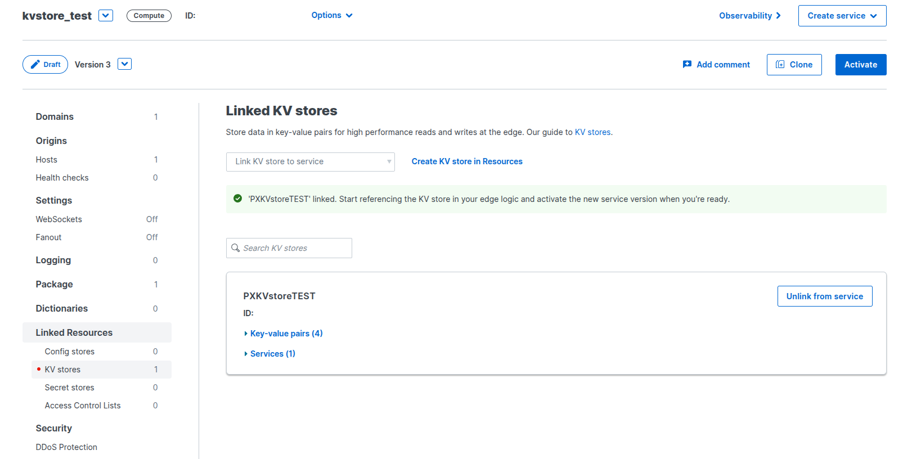
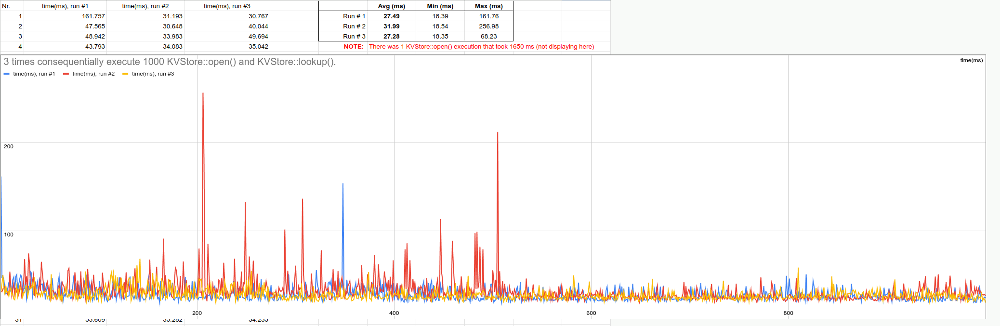

# Fastly KV Store access time test

This test open KVstore and then reads:

* a short string
* an u32 number
* 8KB long string
* 128KB JSON data

Total KVStore size is ~20KB.

## Setup

1. rename `fastly.toml-sample` to `fastly.toml`, build and publish project:`fastly compute build && fastly compute publish`. remember Service URL.
2. execute `./populate_kv.sh` to populate KV Store (a new KV Store will be created: `PXKVstoreTEST`)
3. Link `PXKVstoreTEST` KV Store to the Service using Fastly Web interface and click "Activate":`https://manage.fastly.com/resources/kv-stores` (see the image above)
4. run `python3 collect.py [Service URL] [number of requests to send]` to collect KV Store access times and save to `kv_access_times.csv` CSV file.

## Results

3 times consequentially execute 1000 KVStore::open() and KVStore::lookup(). KVStore doesn't have any modifications.
Calculate Average / Min / Max time for KVStore::open()/KVStore::lookup() functions execution (in ms).

| Run #   | Avg (ms) | Min (ms) | Max (ms) |
|---------|----------|----------|----------|
| Run # 1 | 27.49    | 18.39    | 161.76   |
| Run # 2 | 31.99    | 18.54    | 256.98   |
| Run # 3 | 27.28    | 18.35    | 68.23    |

